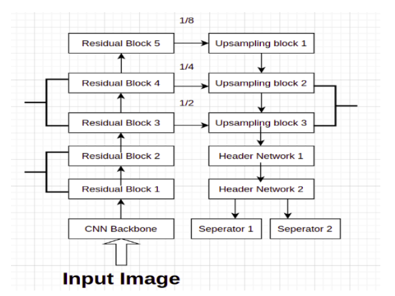
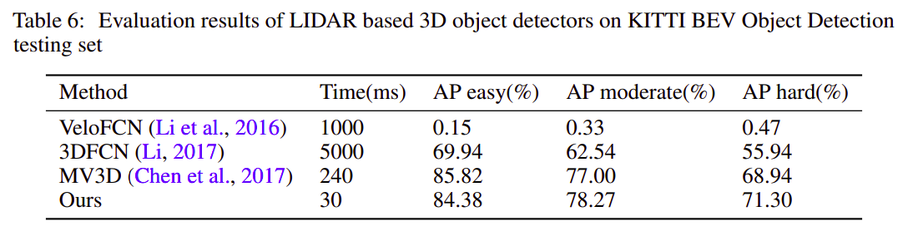
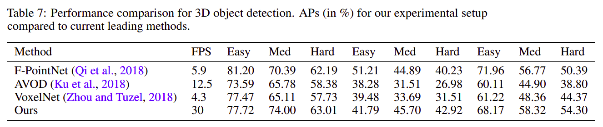
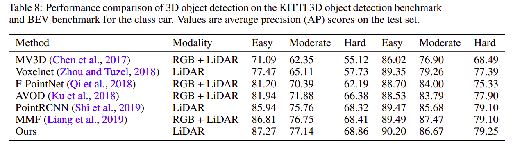
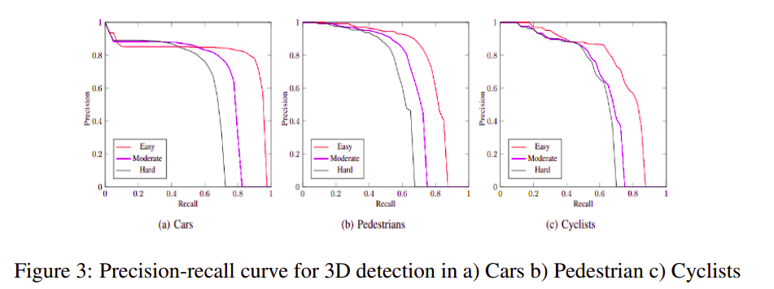

# Learning to Detect 3D Objects from Point Clouds in Real Time
Code for the paper `Learning to Detect 3D Objects from Point Clouds in Real Time`.

Link to [Paper](https://abhinavsagar.github.io/files/object_3d.pdf).

## Abstract

In this work, we address the problem of 3D object detection from point cloud data in
real time. For autonomous vehicles to work, it is very important for the perception
component to detect the real world objects with both high accuracy and fast
inference. We propose a novel neural network architecture along with the training
and optimization details for detecting 3D objects in point cloud data. We compare
the results with different backbone architectures including the standard ones like
VGG, ResNet, Inception with our backbone. Also we present the optimization and
ablation studies including designing an efficient anchor. We use the Kitti 3D Bird’s
Eye View dataset for benchmarking and validating our results. Our work surpasses
the state of the art in this domain both in terms of average precision and speed
running at > 30 FPS. This makes it a feasible option to be deployed in real time
applications including self driving cars.

## Data

The dataset can be downloaded from [here](http://www.cvlibs.net/datasets/kitti/eval_object.php?obj_benchmark=3d).

Data to download include:

Velodyne point clouds (29 GB): input data to VoxelNet
Training labels of object data set (5 MB): input label to VoxelNet
Camera calibration matrices of object data set (16 MB): for visualization of predictions
Left color images of object data set (12 GB): for visualization of predictions

Split the training set into training and validation set. And rearrange the folders to have the following structure:

```
└── KITTI
       ├── training   <-- training data
       |   ├── image_2
       |   ├── label_2
       |   └── velodyne
       └── validation  <--- evaluation data
       |   ├── image_2
       |   ├── label_2
       |   └── velodyne
       |
       |__ train.txt
       |
       |__ val.txt
       |
       |__ trainval.txt
```

## Dependencies

1. python 3.6+
2. Pytorch 
3. opencv-python
4. shapely
5. matplotlib
6. tensorboardX

## Network Architecture



## Train

`python code/train.py`

## Test

`python code/test.py`

## Results







## Average Precision




## Citing

If you find this code useful in your research, please consider citing the paper:

```
@article{sagar2020learning,
  title={Learning to Detect 3D Objects from Point Clouds in Real Time},
  author={Sagar, Abhinav},
  journal={arXiv preprint arXiv:2006.01250},
  year={2020}
}
```

## License

```
MIT License

Copyright (c) 2020 Abhinav Sagar

Permission is hereby granted, free of charge, to any person obtaining a copy
of this software and associated documentation files (the "Software"), to deal
in the Software without restriction, including without limitation the rights
to use, copy, modify, merge, publish, distribute, sublicense, and/or sell
copies of the Software, and to permit persons to whom the Software is
furnished to do so, subject to the following conditions:

The above copyright notice and this permission notice shall be included in all
copies or substantial portions of the Software.

THE SOFTWARE IS PROVIDED "AS IS", WITHOUT WARRANTY OF ANY KIND, EXPRESS OR
IMPLIED, INCLUDING BUT NOT LIMITED TO THE WARRANTIES OF MERCHANTABILITY,
FITNESS FOR A PARTICULAR PURPOSE AND NONINFRINGEMENT. IN NO EVENT SHALL THE
AUTHORS OR COPYRIGHT HOLDERS BE LIABLE FOR ANY CLAIM, DAMAGES OR OTHER
LIABILITY, WHETHER IN AN ACTION OF CONTRACT, TORT OR OTHERWISE, ARISING FROM,
OUT OF OR IN CONNECTION WITH THE SOFTWARE OR THE USE OR OTHER DEALINGS IN THE
SOFTWARE.
```
